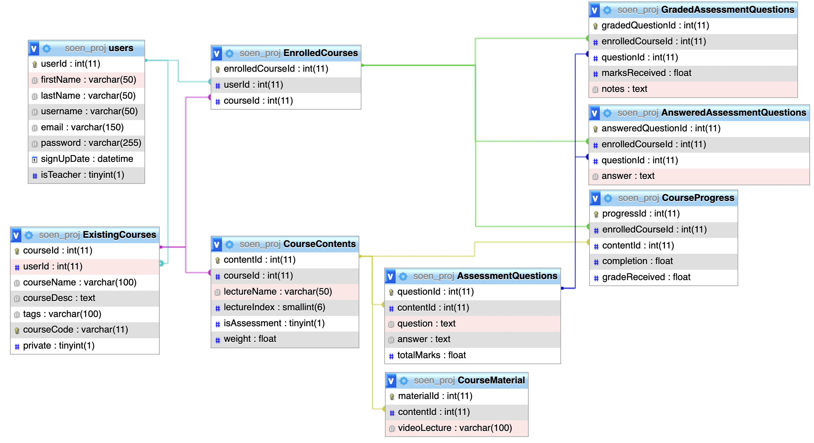

### StudyForever
#### Delivery 1:
- **Frontend**
  - Views:
    - Template Inheritance – [base view](base.php) 
    - [Registration page](register.php)
    - [Login page](login.php)
    - [Home/About page](index.php)
  - Styles:
    - [base styles](assets/style/base.css)
    - [styles](assets/style/style.css)
- **Backend**:
  - 
  - [DataBase connection](includes/config.php)
  - Authentication
    - [Registration Form Sanitization](includes/classes/FormSanitizer.php)
    - [Registration/Auth Form Validation](includes/classes/UserAccounts.php)
    - [Error handling](includes/classes/Constants.php)

#### TODO Delivery 2:
- Front End:
  - Views:
    - Views for course creation
    - Teacher & student dashboard
    - Explore page
- Backend:
  - Adding new course
  - Adding material and assessments to course
  - Grading assignments
  - Enrolling in courses
  - Course statistics
